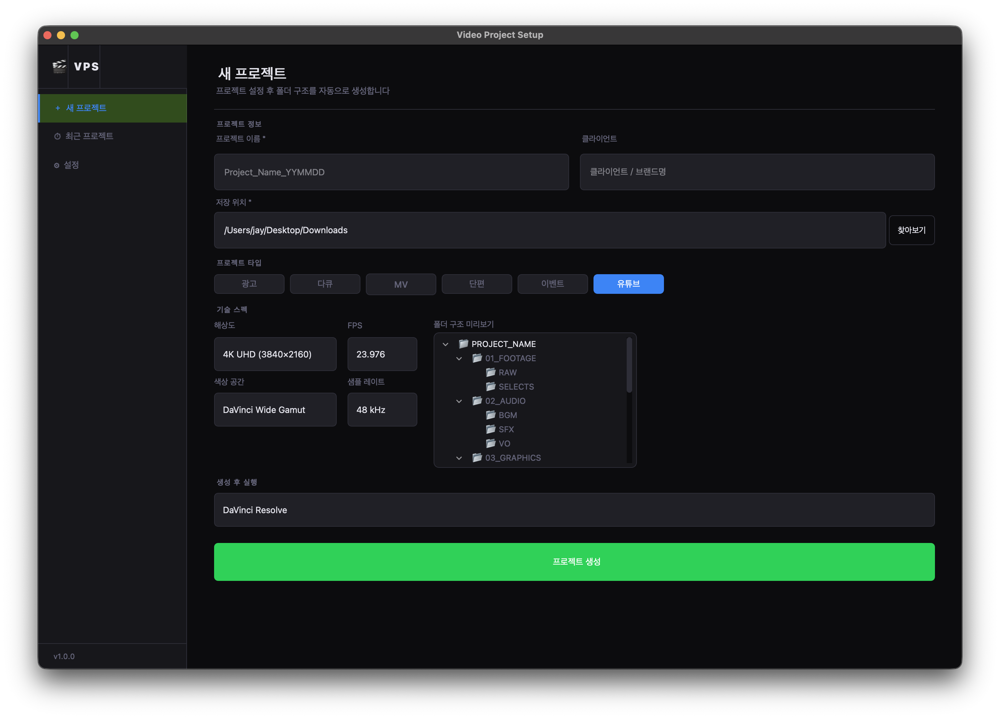
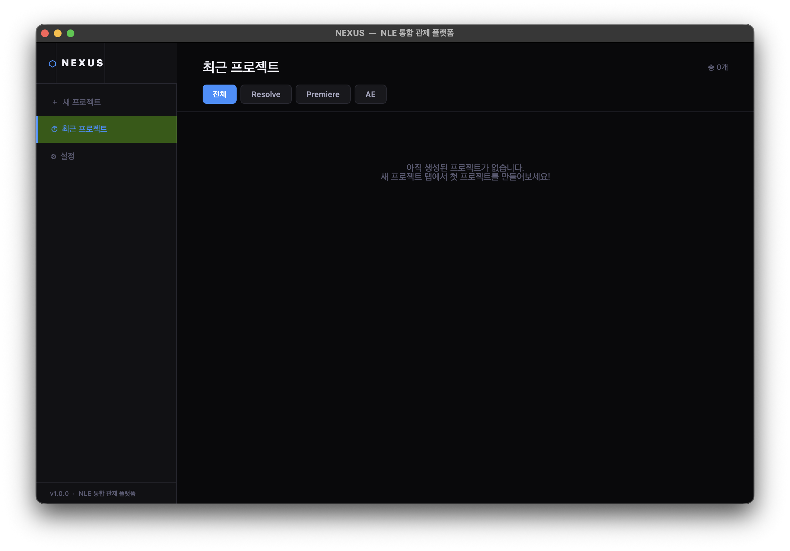
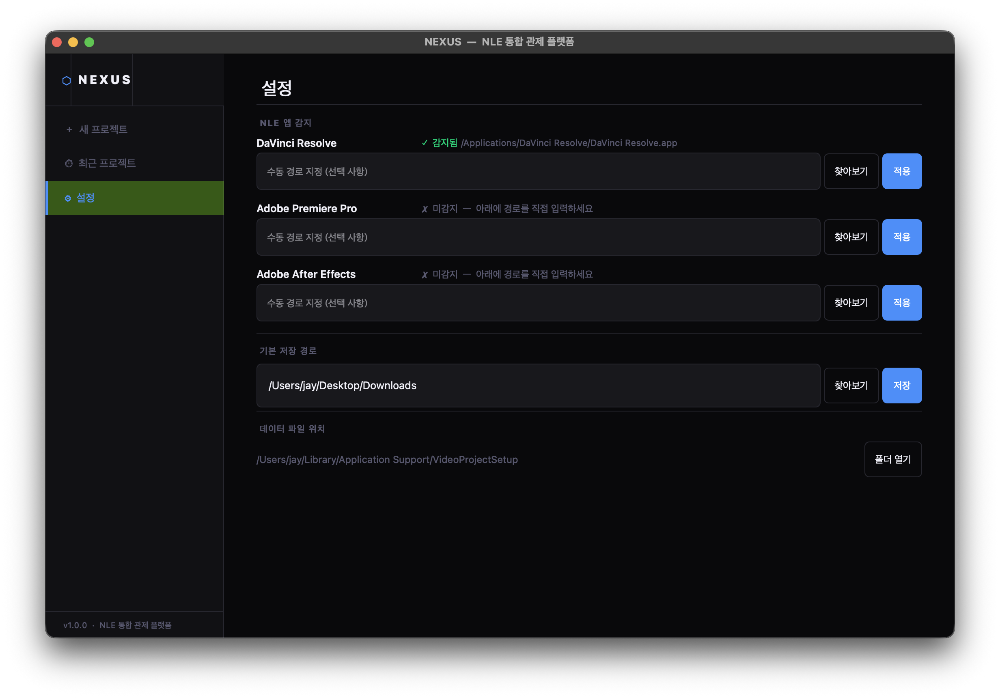

# NEXUS — NLE 통합 관제 플랫폼

영상 프로덕션 워크플로우를 위한 데스크톱 앱.
NLE 실행 전에 프로젝트 폴더 구조를 자동 생성하고, DaVinci Resolve / Premiere Pro / After Effects 빈(Bin)을 자동으로 세팅합니다.

---

## 스크린샷

**새 프로젝트** — 타입 선택, 기술 스펙, 폴더 트리 미리보기, NLE 자동 연동


**최근 프로젝트** — NLE 필터, 버전 스냅샷, 복원


**설정** — NLE 앱 감지 상태, 기본 저장 경로


---

## 주요 기능

| 기능 | 설명 |
|------|------|
| **폴더 자동 생성** | 광고 / 다큐 / MV / 단편 / 이벤트 / 유튜브 타입별 프리셋 |
| **커스텀 폴더 트리** | 타입별 폴더 구조 직접 편집 + 영구 저장 |
| **Resolve API 연동** | 빈 구조 자동 생성 + 해상도 / FPS / 색상 공간 / 샘플 레이트 적용 |
| **Premiere / AE** | JSX 스크립트로 프로젝트 파일 + 빈 구조 자동 생성 |
| **스마트 스냅샷** | Resolve 실행 중이면 현재 작업 상태를 API로 직접 내보냄 |
| **버전 복원** | V001 / V002 ... 버전 관리 + 원클릭 복원 |
| **최근 프로젝트** | NLE별 필터 탭, 최대 10개 표시 |

---

## 설치 & 실행

### 바이너리 다운로드 (권장)
[Releases](../../releases) 페이지에서 플랫폼에 맞는 ZIP을 다운로드하세요.

| 파일 | 플랫폼 |
|------|--------|
| `NEXUS-Windows.zip` | Windows 10/11 (x64) |
| `NEXUS-macOS-AppleSilicon.zip` | macOS (M1 / M2 / M3 / M4) |

### 소스에서 실행

```bash
pip install PyQt6
python main.py
```

### 직접 빌드

```bash
# macOS
chmod +x build_mac.sh && ./build_mac.sh

# Windows
build_win.bat
```

---

## DaVinci Resolve 연동 요구사항

Resolve API 연동을 사용하려면 Scripting Modules가 필요합니다.

- **macOS**: `/Library/Application Support/Blackmagic Design/DaVinci Resolve/Developer/Scripting/Modules`
- **Windows**: `C:\ProgramData\Blackmagic Design\DaVinci Resolve\Support\Developer\Scripting\Modules`

DaVinci Resolve 설치 시 자동으로 포함됩니다.

---

## 기술 스택

- **UI**: PyQt6
- **번들링**: PyInstaller (macOS `.app` / Windows `.exe`)
- **데이터 저장**: JSON (`~/Library/Application Support/VideoProjectSetup/`)
- **CI/CD**: GitHub Actions (Windows / macOS Apple Silicon 자동 빌드)

---

## Changelog

### v1.1.0
- **Resolve 기술 스펙 자동 적용** — 해상도, FPS, 색상 공간, 샘플 레이트를 프로젝트 생성 시 Resolve API로 직접 설정
- **스마트 스냅샷** — Resolve 실행 중이면 현재 작업 상태를 API로 직접 내보냄, 미실행 시 .drp 파일 복사 폴백
- **폴더 트리 커스텀 프리셋** — 프로젝트 타입별 폴더 구조를 직접 편집하고 영구 저장
- **앱 아이콘** — NEXUS 전용 아이콘 (macOS `.icns` / Windows `.ico`)

### v1.0.1
- 앱 아이콘 추가
- 스크린샷 업데이트

### v1.0.0
- 최초 릴리즈
